<br># 🧠 LLM-TeamGym

> **A professional, multi-paradigm benchmark library for evaluating Large Language Models in strategy games — from classic board games to complex multi-team negotiation scenarios.**

LLM-TeamGym is an OpenAI Gym / PettingZoo-inspired framework purpose-built for the unique challenges of LLM-based agents: **text-only state observations, structured legal-move prompting, hidden-information masking, and team coordination channels.**  
It ships with **23 fully implemented games** across 5 paradigm families, a tournament runner, JSONL transcript logging, and real-time Pygame visualization.

---

## 🗂️ Repository Structure

```
LLM-TeamGym/
├── llm_team_gym/
│   ├── core/
│   │   ├── base_game.py          # Abstract BaseGame interface
│   │   └── base_agent.py         # Abstract BaseAgent + RandomAgent / HumanCLIAgent
│   ├── envs/
│   │   ├── tournament.py         # MatchRunner + TournamentRunner
│   │   └── logger.py             # JSONL transcript logging
│   └── games/                    # 23 complete game implementations
│       ├── team_fish.py
│       ├── connect_four.py
│       └── … (20 more)
├── docs/
│   └── images/                   # Auto-generated Pygame screenshots
├── main.py                       # CLI entry point
├── requirements.txt
├── test_all_games.py
├── test_social_deduction.py
└── test_new_batches.py
```

---

## 🏗️ Architecture Overview

```
┌──────────────────────────────────────────────────────────┐
│                      MatchRunner                         │
│                                                          │
│   while not game_over:                                   │
│     for each agent with legal_moves:                     │
│       obs  = game.get_text_state(agent_id)  ──► LLM     │
│       rule = game.get_game_rules()          ──► prompt   │
│       action = agent.choose_action(…)       ◄── LLM     │
│     game.step(actions_dict)                              │
│     logger.record(step)                                  │
└──────────────────────────────────────────────────────────┘
          │                   │
    ┌─────▼─────┐       ┌─────▼──────┐
    │  BaseGame  │       │ BaseAgent  │
    │ (abstract) │       │ (abstract) │
    └─────┬─────┘       └─────┬──────┘
          │                   │
    ┌─────▼─────────────┐ ┌───▼──────────────┐
    │ 23 game classes   │ │ RandomAgent       │
    │ all implement:    │ │ GreedyAgent       │
    │  · reset()        │ │ HumanCLIAgent     │
    │  · step()         │ │ YOUR LLM agent    │
    │  · get_text_state │ └──────────────────┘
    │  · get_legal_moves│
    │  · get_game_rules │
    │  · render()       │
    └───────────────────┘
```

### Core Interfaces

#### `BaseGame` — `llm_team_gym/core/base_game.py`

| Method | Signature | Description |
|--------|-----------|-------------|
| `reset()` | `→ Dict[AgentID, Observation]` | Initialize / restart game state |
| `step(actions)` | `Dict[AgentID, Action] → StepResult` | Advance one time-step |
| `get_text_state(agent_id)` | `AgentID → str (JSON)` | **Agent-specific** text observation with hidden info masked |
| `get_legal_moves(agent_id)` | `AgentID → List[Action]` | Strictly validated move list; empty = not your turn |
| `get_game_rules()` | `→ str` | Full natural-language rule prompt injected per episode |
| `render(mode)` | `→ None` | Real-time Pygame visualization |
| `teams` | `@property → Dict[TeamID, List[AgentID]]` | Team composition map |

#### `BaseAgent` — `llm_team_gym/core/base_agent.py`

```python
class MyLLMAgent(BaseAgent):
    def choose_action(
        self,
        observation: Observation,
        text_state: str,        # JSON string from get_text_state()
        legal_moves: List[str], # ONLY valid actions — no hallucination risk
        game_rules: str,        # get_game_rules() output
    ) -> Action:
        # call your LLM here with text_state + legal_moves as the prompt
        ...
```

#### `MatchRunner` — `llm_team_gym/envs/tournament.py`

```python
from llm_team_gym.envs.tournament import MatchRunner
from llm_team_gym.games.connect_four import ConnectFourGame

runner = MatchRunner(
    game=ConnectFourGame(),
    agents={"player_1": my_gpt4_agent, "player_2": my_claude_agent},
    render=True,
    verbose=True,
    match_id="gpt4_vs_claude_001",
)
record = runner.run()   # returns MatchRecord with full transcript
```

**Turn-based and simultaneous games are handled identically** — MatchRunner collects from all agents returning non-empty `legal_moves`, then calls `step()` once.

---

## ✨ Feature Highlights

| Feature | Detail |
|---------|--------|
| **23 Complete Games** | 5 paradigm families: grid strategy, board games, social deduction, cards, game theory |
| **Text-Native States** | Every `get_text_state()` returns structured JSON tailored per agent — hidden info properly masked |
| **Legal-Move Guardrails** | `get_legal_moves()` provides only strictly valid actions — eliminates LLM hallucination of illegal moves |
| **Hidden Information** | Per-agent asymmetric state: Hanabi hands, Resistance spy identities, Captain Sonar positions |
| **Team Channels** | `teammates_of()`, `opponents_of()`, `agent_to_team()` utilities for group coordination |
| **Simultaneous Play** | IPD, RPS, Tragedy of the Commons, Stock Market — all agents move in the same step |
| **Turn-Based Rotation** | Single-active-agent games: only the active player has non-empty `legal_moves` |
| **Rule Injection** | `get_game_rules()` returns a complete natural-language rulebook per game for zero-shot prompting |
| **Pygame Visualization** | Every game has a real-time renderer with team-color-coded elements and info panels |
| **JSONL Logging** | `MatchLogger` writes per-step structured records for downstream analysis |
| **Tournament Runner** | `TournamentRunner` runs N matches with factory callables, aggregates win rates |
| **Seeded Reproducibility** | All stochastic games accept a `seed` parameter |

---

## 🎮 Game Catalog

### 📦 Batch 1 — Grid & Territory

#### Team Fish
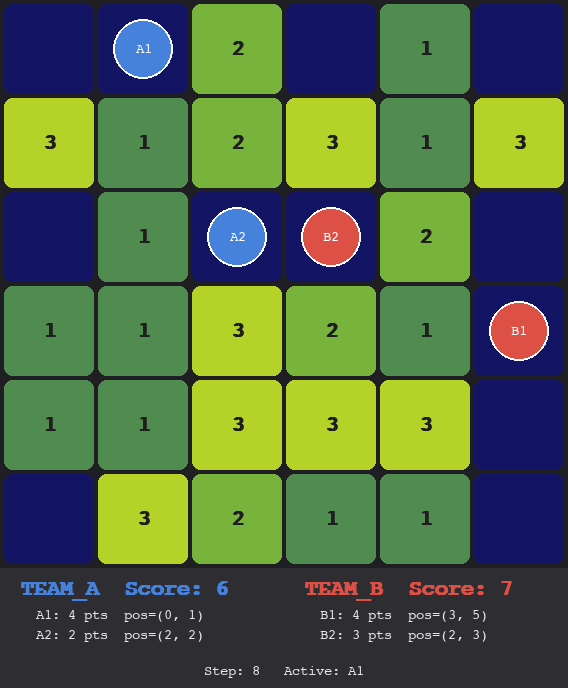

> **2v2 grid team game.** Agents navigate an N×M grid harvesting fish tiles. Moving destroys the tile behind you. Team with the highest combined harvest wins.

| Property | Value |
|----------|-------|
| Players | A1, A2 (team_A) vs B1, B2 (team_B) |
| Turn Order | A1 → B1 → A2 → B2 |
| Action Format | `"right 2"`, `"down 1"`, `"left 3"` |
| State | Grid layout, agent positions, tile values, team scores |
| Scoring | Sum of fish harvested per team |

---

### 📦 Batch 2 — Classic Board & Grid Games

#### Connect Four
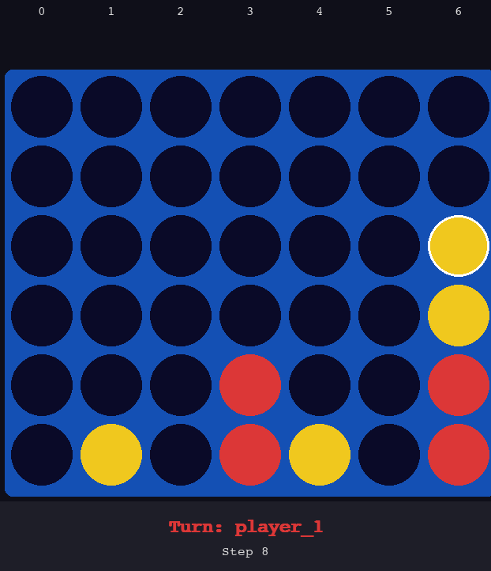

> **Classic 2-player gravity puzzle.** Drop colored tokens into a 6×7 grid. First to form a horizontal, vertical, or diagonal line of 4 wins.

| Property | Value |
|----------|-------|
| Players | player_1 (Red) vs player_2 (Yellow) |
| Action Format | Column integer `0`–`6` |
| State | 6×7 board with token positions, legal columns |
| Scoring | +1 win / −1 loss / 0 draw |

---

#### Extended Tic-Tac-Toe (5×5, Win 4)
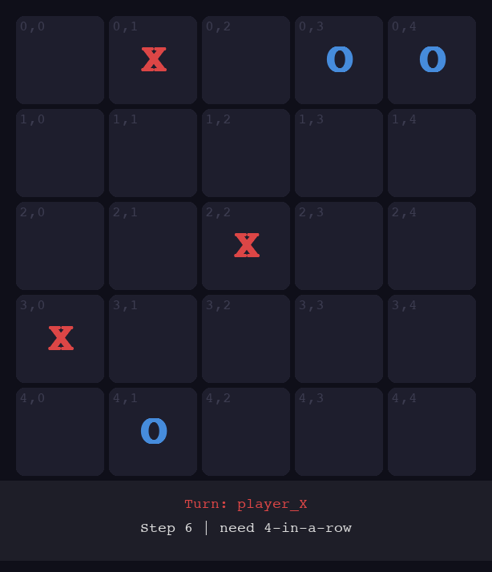

> **Expanded version on a 5×5 grid.** First to align 4 marks in any direction wins. More strategic depth than classic 3×3.

| Property | Value |
|----------|-------|
| Players | player_X vs player_O |
| Action Format | `"row col"` (e.g. `"2 3"`) |
| State | 5×5 board, whose turn, winning line highlighted |
| Scoring | +1 / −1 / 0 |

---

#### Mancala
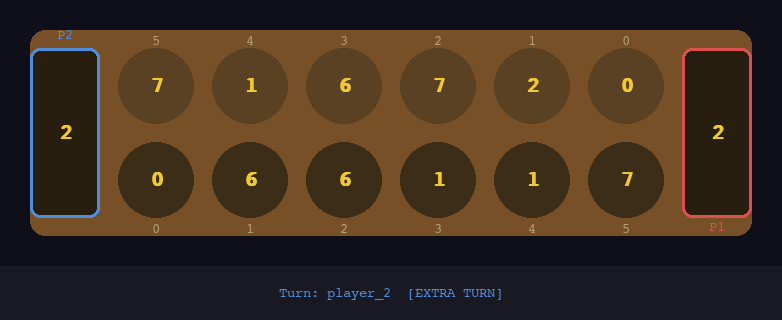

> **Ancient pit-and-store strategy.** Sow seeds across 14 pits. Earn extra turns, capture opponent seeds, highest store wins.

| Property | Value |
|----------|-------|
| Players | player_1 vs player_2 |
| Action Format | Pit index `0`–`5` (own side) |
| State | Full 14-position board, seed counts, whose turn |
| Special Rules | Extra turn on store landing; opponent capture |

---

#### Othello (Reversi)
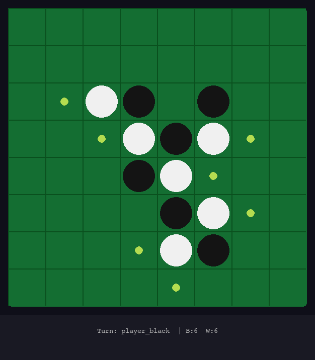

> **Flip-based territory control on 8×8.** Place a disc to flank and flip opponent discs. Most discs at end wins. Pass if no legal placement.

| Property | Value |
|----------|-------|
| Players | player_black vs player_white |
| Action Format | `"row col"` or `"pass"` |
| State | 8×8 board, legal placements highlighted, disc counts |
| Scoring | +1 / −1 / 0 by disc count |

---

#### Gomoku
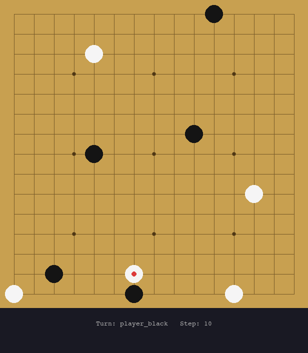

> **15×15 five-in-a-row.** First to form an unbroken chain of 5 stones horizontally, vertically, or diagonally wins. 

| Property | Value |
|----------|-------|
| Players | player_black vs player_white |
| Action Format | `"row col"` |
| State | 15×15 board, move history |
| Config | Customizable `size` and `win_len` |

---

#### Gardner Mini Chess (5×5)
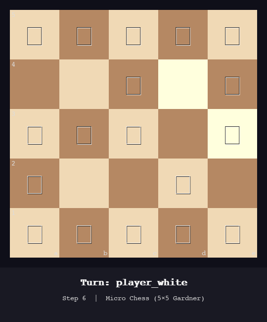

> **Full chess rules on a 5×5 Gardner setup.** All piece types present. Complete check/checkmate/stalemate detection with pseudo-legal move filtering.

| Property | Value |
|----------|-------|
| Players | player_white vs player_black |
| Action Format | Algebraic `"e2e3"`, `"b1c3"` |
| State | Board FEN-style layout, legal moves, check indicator |
| Pieces | R, N, B, Q, K + Pawns (promote on rank 5/1) |

---

#### Capture the Flag
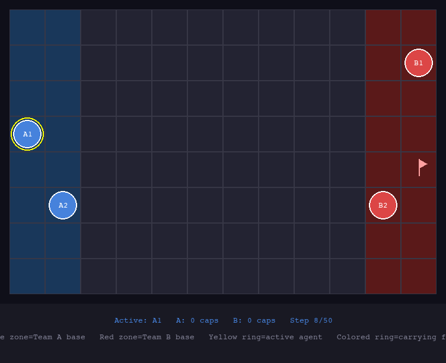

> **2v2 tactical grid.** Grab the opponent's flag and return it to your base. Tag enemies to reset them. First to 3 captures wins.

| Property | Value |
|----------|-------|
| Players | A1, A2 (team_A) vs B1, B2 (team_B) |
| Action Format | `"up"` `"down"` `"left"` `"right"` `"stay"` |
| State | 8×12 grid, agent positions, flag locations, carry status, scores |
| Win | First team to 3 flag captures |

---

### 📦 Batch 3 — Social Deduction & Limited Information

#### The Resistance
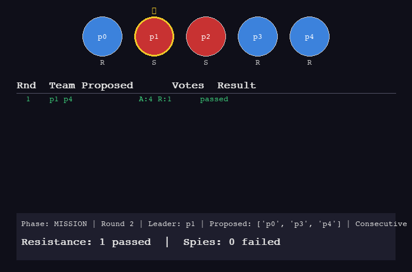

> **Asymmetric social deduction.** 5 players — 3 Resistance, 2 Spies. Spies know each other; Resistance players do not. Propose mission teams, vote, execute. Resistance wins 3 successful missions; Spies win by sabotaging 3.

| Property | Value |
|----------|-------|
| Players | p0–p4 (roles hidden) |
| Phases | PROPOSE → VOTE → MISSION |
| Hidden Info | Spies see allies; Resistance sees `[HIDDEN...]` |
| Action Format | Proposal: `"p0 p2"` · Vote: `"approve"/"reject"` · Mission: `"pass"/"sabotage"` |

---

#### Hanabi
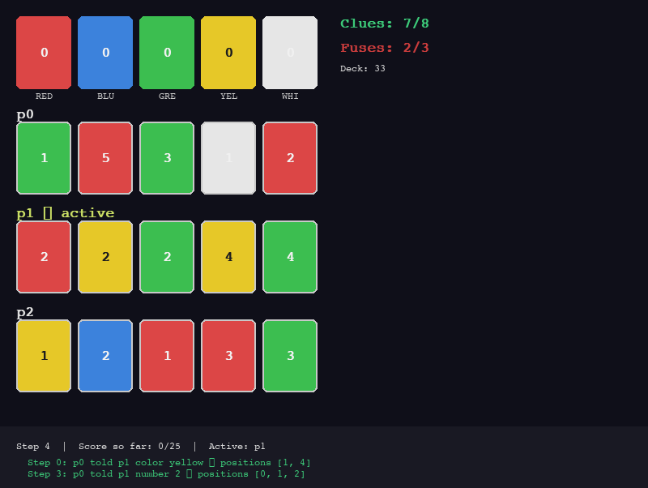

> **Cooperative inference puzzle.** Players see everyone's cards except their own. Give color/number clues to help teammates play cards in the correct ascending sequence. Maximize the joint score.

| Property | Value |
|----------|-------|
| Players | 2–4 (single `cooperation_team`) |
| Hidden Info | Own hand is `HIDDEN`; all teammates' cards visible |
| Action Format | `"play 0"` · `"discard 2"` · `"clue p1 color red"` · `"clue p2 number 3"` |
| State | Known clues per card slot, fireworks progress, fuse/clue tokens |
| Win | Score ≥ 20 → +1 · Score ≥ 10 → 0 · else −1 |

---

#### Captain Sonar Mini
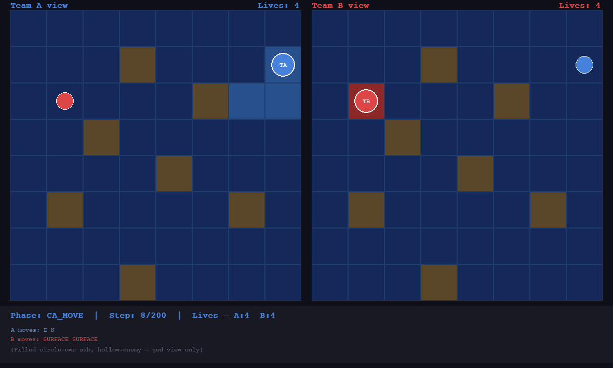

> **2v2 submarine warfare with role asymmetry.** Each team has a Captain (knows position, chooses direction) and a Radio Operator (tracks enemy movement logs, fires torpedoes). Sink the enemy sub to win.

| Property | Value |
|----------|-------|
| Players | CA, RA (team_A) vs CB, RB (team_B) |
| Phases | CA_MOVE → RA_ACT → CB_MOVE → RB_ACT |
| Hidden Info | Captain sees exact coordinates; RO sees only movement log; enemy position never shown directly |
| Action Format | Captain: `"north"/"surface"` · RO: `"torpedo 3 5"/"sonar"/"pass"` |

---

### 📦 Batch 4 — Cards & Risk Management

#### Yaniv
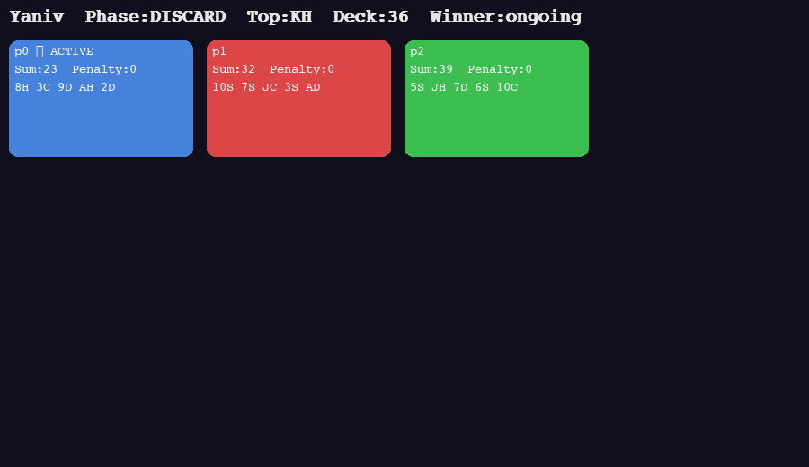

> **Israeli bluff-and-risk card game.** Discard valid combinations to reduce hand sum. Call "Yaniv" when hand ≤ 7. Beware the Assaf — if an opponent ties or beats your sum, you take a +30 penalty!

| Property | Value |
|----------|-------|
| Players | 2–4 (each own team) |
| Phases | DISCARD (or call Yaniv) → DRAW |
| Valid Discards | Single card · Set (same rank) · Run (3+ consecutive, same suit) · Joker wild |
| Action Format | `"5H 5D"` · `"3S 4S 5S"` · `"yaniv"` · `"deck"` · `"pile"` |
| Card Values | A=1, 2–10=face, J=11, Q=12, K=13, Joker=0 |

---

#### Blackjack
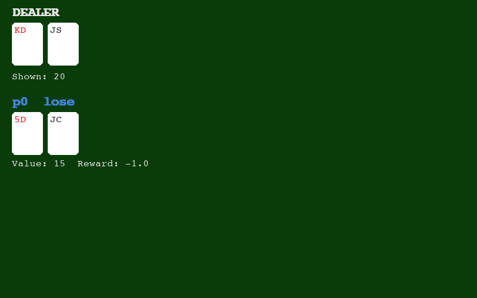

> **Casino-style card game against an automated dealer.** Hit, stand, or double-down. Dealer hits on soft ≤16. Blackjack pays 1.5×.

| Property | Value |
|----------|-------|
| Players | 1–3 (each vs automated dealer) |
| Action Format | `"hit"` · `"stand"` · `"double"` (first action only) |
| State | Your hand + value, dealer visible card, legal actions |
| Outcomes | Blackjack +1.5 · Win +1 · Push 0 · Lose −1 · Double doubles stakes |

---

#### Team Taki (2v2)
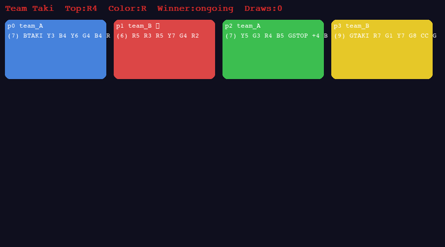

> **Israeli Uno variant with team mechanics.** (p0, p2) vs (p1, p3). First team where BOTH partners empty their hands wins. Features the TAKI card (play multi-card same-color sequences).

| Property | Value |
|----------|-------|
| Players | p0–p3 · Teams: (p0,p2) vs (p1,p3) |
| Special Cards | STOP · +2 · TAKI (multi-play) · Color Change · +4 |
| Action Format | `"play R5"` · `"taki R3 R7 RSTOP"` · `"draw"` · `"end_taki"` |
| Card Format | Color (R/B/Y/G) + Type (1–9 / STOP / +2 / TAKI) · Wilds: CC, +4 |

---

#### Bridge / Wist
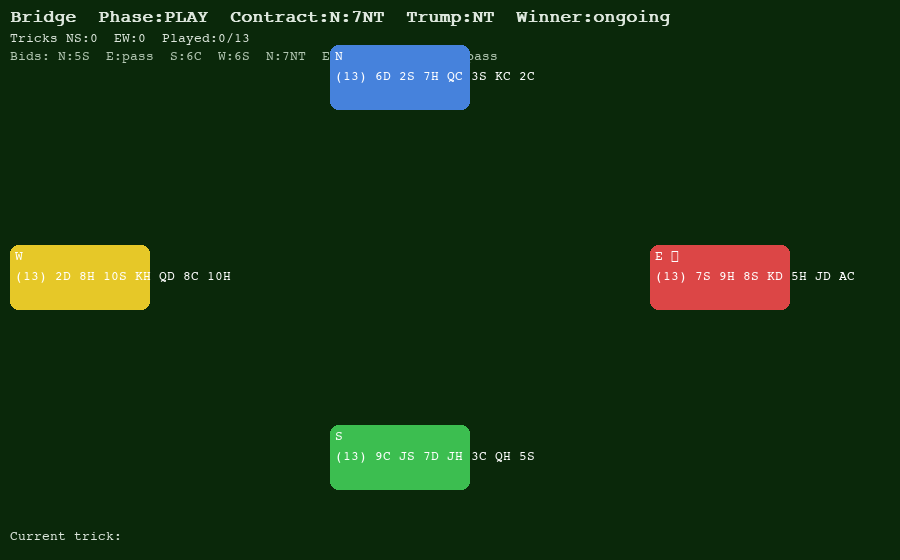

> **4-player trick-taking with a bidding phase.** N/S vs E/W. Bid to declare a contract (trump suit + number of tricks). Declarer team must fulfill the contract across 13 tricks; defenders try to stop them.

| Property | Value |
|----------|-------|
| Players | N, E, S, W · Teams: NS vs EW |
| Phases | BIDDING (ordered by suit rank) → PLAY (13 tricks) |
| Follow-Suit | Mandatory — enforced in `get_legal_moves()` |
| Bid Format | `"1NT"` · `"3H"` · `"7S"` · `"pass"` |
| Card Format | `"AH"` · `"10S"` · `"2D"` |

---

### 📦 Batch 5 — Game Theory, Economy & Negotiation

#### Iterated Prisoner's Dilemma
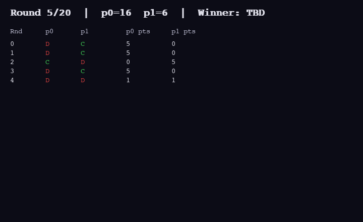

> **Classic cooperation-vs-defection benchmark.** 20 simultaneous rounds. Full history visible — enables emergent strategies like Tit-for-Tat, Grim Trigger, and Pavlov.

| Property | Value |
|----------|-------|
| Players | p0, p1 (simultaneous) |
| Action Format | `"cooperate"` or `"defect"` |
| Payoffs | CC→(3,3) · CD→(0,5) · DC→(5,0) · DD→(1,1) |
| State | Full round-by-round history for both agents |

---

#### Ultimatum Game
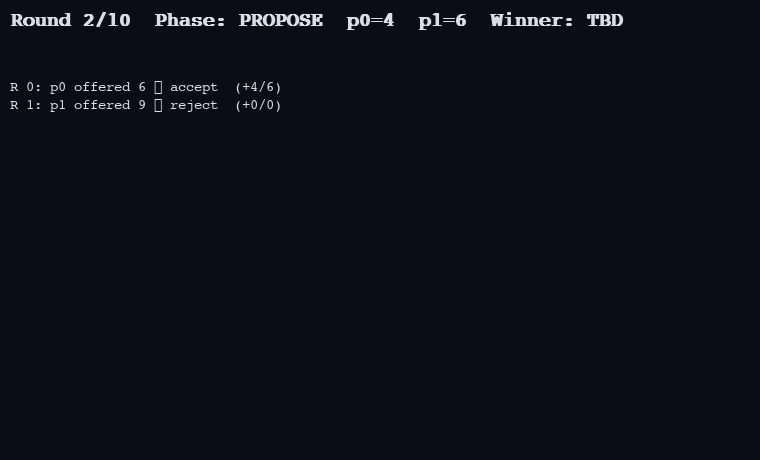

> **Fairness and negotiation benchmark.** Proposer splits a pot of 10 coins. Responder accepts or rejects — rejection means both get nothing. Roles alternate. Tests fairness norms vs. rational self-interest.

| Property | Value |
|----------|-------|
| Players | p0, p1 (roles alternate) |
| Action Format | Proposer: `"offer 3"` · Responder: `"accept"/"reject"` |
| Rounds | Configurable (default 10) |
| State | Role indicator, pending offer, full history |

---

#### Extended Rock-Paper-Scissors (RPSLS)
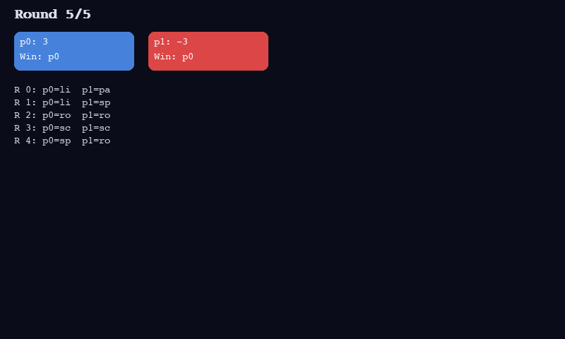

> **Rock-Paper-Scissors-Lizard-Spock.** 5 choices with the full win graph. 2–4 players, simultaneous reveals, pairwise scoring. Tests mixed-strategy equilibrium discovery.

| Property | Value |
|----------|-------|
| Players | 2–4 (simultaneous) |
| Action Format | `"rock"` · `"paper"` · `"scissors"` · `"lizard"` · `"spock"` |
| Scoring | +1 per opponent beaten · −1 per loss |
| State | Full win matrix in text state, round history |

---

#### Dollar Auction
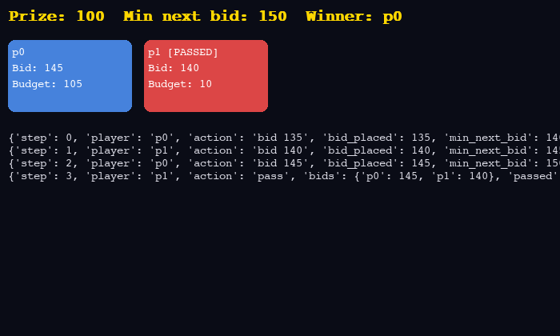

> **The Shubik Paradox.** Auction a prize where BOTH the highest AND second-highest bidder pay. Creates a sunk-cost trap — rational agents over-bid past the prize value. Tests commitment and escalation reasoning.

| Property | Value |
|----------|-------|
| Players | 2–4 (turn-based) |
| Action Format | `"bid 15"` or `"pass"` |
| Trap | Both top-2 bidders pay; only winner gets prize |
| State | All current bids, min next bid, budgets, warning |

---

#### Tragedy of the Commons
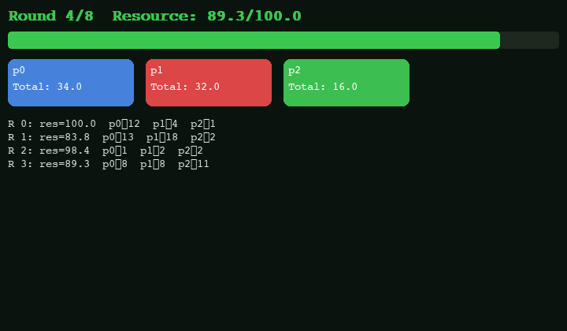

> **Collective resource management.** Shared fishery regenerates 25% each round. Over-harvesting collapses the resource permanently. Simultaneous harvest decisions test coordination under incentive misalignment.

| Property | Value |
|----------|-------|
| Players | 2–4 (simultaneous) |
| Action Format | `"harvest N"` (N = 0–20) |
| Resource | Starts 100, regenerates 25%, collapses if ≤ 10 |
| Win | Highest cumulative harvest after N rounds |

---

#### Stock Market Simulation
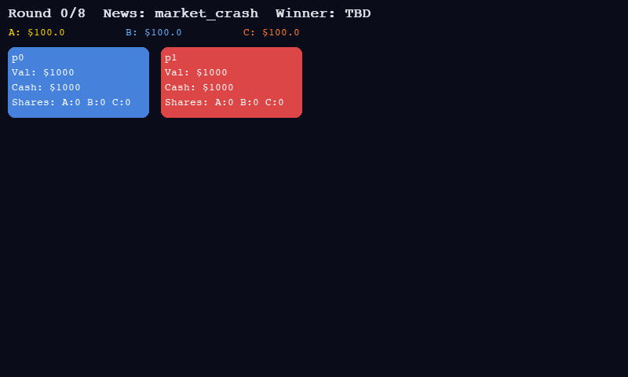

> **Multiplayer portfolio management.** 3 stocks with news events and collective price pressure. Buy, sell, short, and cover across 20 rounds. Highest portfolio value wins.

| Property | Value |
|----------|-------|
| Players | 2–4 (simultaneous) |
| Action Format | `"buy A"` · `"sell B"` · `"short C"` · `"cover A"` · `"hold"` |
| Price Dynamics | News effect + player buy/sell pressure + noise |
| State | Current news hint, prices, your portfolio, all portfolios |

---

#### Dice Race — The Pig Game
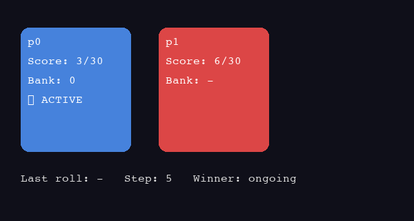

> **Pure risk management benchmark.** Roll a die to accumulate turn points. Bank them to secure your score, or roll again — but rolling a 1 wipes your turn bank. First to 100 wins.

| Property | Value |
|----------|-------|
| Players | 2–4 (turn-based) |
| Action Format | `"roll"` or `"bank"` |
| Risk | Rolling 1 loses all turn bank points |
| Optimal Play | Bank probability analysis; opponent score awareness |

---

#### Settlers of Catan Mini
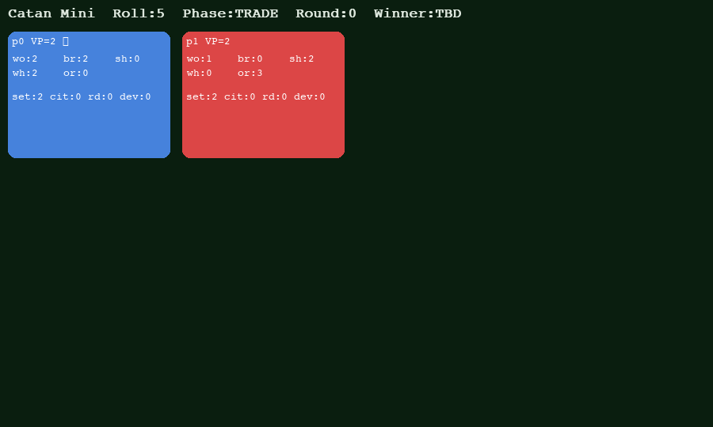

> **Simplified Catan with full trading dynamics.** Dice roll triggers resource production. Trade with the bank (4:1) or negotiate with other players. Build settlements, cities, and dev cards. Race to 10 Victory Points.

| Property | Value |
|----------|-------|
| Players | 2–4 (turn-based + simultaneous trade phase) |
| Resources | wood, brick, sheep, wheat, ore |
| Action Format | `"build settlement"` · `"bank_trade 4 wood for ore"` · `"offer p1 2 wheat for 1 ore"` · `"end_turn"` |
| Phases | TRADE (offer/bank/skip) → BUILD |
| Win | First to 10 Victory Points |

---

## 🚀 Quick Start

### 1. Clone & Install

```bash
git clone https://github.com/yogevat/LLM-TeamGym.git
cd LLM-TeamGym

python -m venv .venv
source .venv/bin/activate        # Windows: .venv\Scripts\activate

pip install -r requirements.txt
```

### 2. Run a Match (CLI)

```bash
# Play Connect Four with two random agents (Pygame window)
python main.py --game connect_four --render

# Play Iterated Prisoner's Dilemma (text only)
python main.py --game iterated_prisoners_dilemma --no-render

# 3-player Yaniv with verbose step logging
python main.py --game yaniv --n-players 3 --verbose
```

### 3. Integrate Your LLM Agent

```python
from llm_team_gym.core.base_agent import BaseAgent
from llm_team_gym.envs.tournament import MatchRunner
from llm_team_gym.games.connect_four import ConnectFourGame

class GPT4Agent(BaseAgent):
    def choose_action(self, observation, text_state, legal_moves, game_rules):
        prompt = f"""
{game_rules}

Current state:
{text_state}

Legal actions: {legal_moves}

Choose exactly one action from the list above. Reply with only the action string.
"""
        response = openai.chat.completions.create(
            model="gpt-4o",
            messages=[{"role": "user", "content": prompt}],
        )
        action = response.choices[0].message.content.strip()
        return action if action in legal_moves else legal_moves[0]

game    = ConnectFourGame(seed=42)
agents  = {
    "player_1": GPT4Agent("player_1", "player_1"),
    "player_2": GPT4Agent("player_2", "player_2"),
}
runner  = MatchRunner(game=game, agents=agents, render=True, verbose=True)
record  = runner.run()

print(f"Winner: {record.winner}")
print(f"Steps: {record.total_steps}")
```

### 4. Run a Tournament

```python
from llm_team_gym.envs.tournament import TournamentRunner

def game_factory():  return ConnectFourGame(seed=None)
def agent_factory(): return {"player_1": GPT4Agent(...), "player_2": ClaudeAgent(...)}

tournament = TournamentRunner(
    game_factory=game_factory,
    agent_factory=agent_factory,
    n_matches=50,
)
results = tournament.run()
print(results.win_rates)   # {"player_1": 0.58, "player_2": 0.42}
```

### 5. Run the Test Suites

```bash
python test_all_games.py          # 7 board games
python test_social_deduction.py   # 3 hidden-info games
python test_new_batches.py        # 12 cards + game theory games
```

---

## 📦 Requirements

```
pygame>=2.1.0
```

Python 3.9+ required. No external ML frameworks needed for the core library.

---

## 🗺️ Design Principles

1. **Text-First** — Every state is JSON-serializable text. Your LLM sees the same information a human player would read.
2. **No Hallucinated Moves** — `get_legal_moves()` returns ONLY strictly legal actions. Plug it directly into your prompt as the choice set.
3. **Asymmetric Information by Default** — `get_text_state(agent_id)` masks information the agent shouldn't have — spy identities, hidden hands, enemy positions.
4. **Framework-Agnostic** — Works with any LLM (OpenAI, Anthropic, Ollama, local) or any scripted agent. No framework lock-in.
5. **Evaluator-Friendly** — JSONL transcripts make per-step analysis, strategy identification, and LLM comparison straightforward.

---

## 📄 License

MIT License — see [LICENSE](LICENSE) for details.

---

*Built with ❤️ as a research tool for the multi-agent AI community.*
